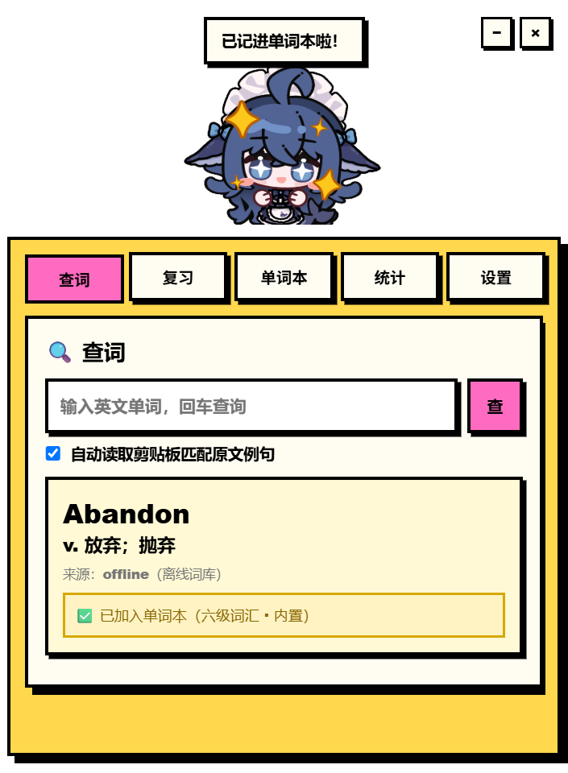
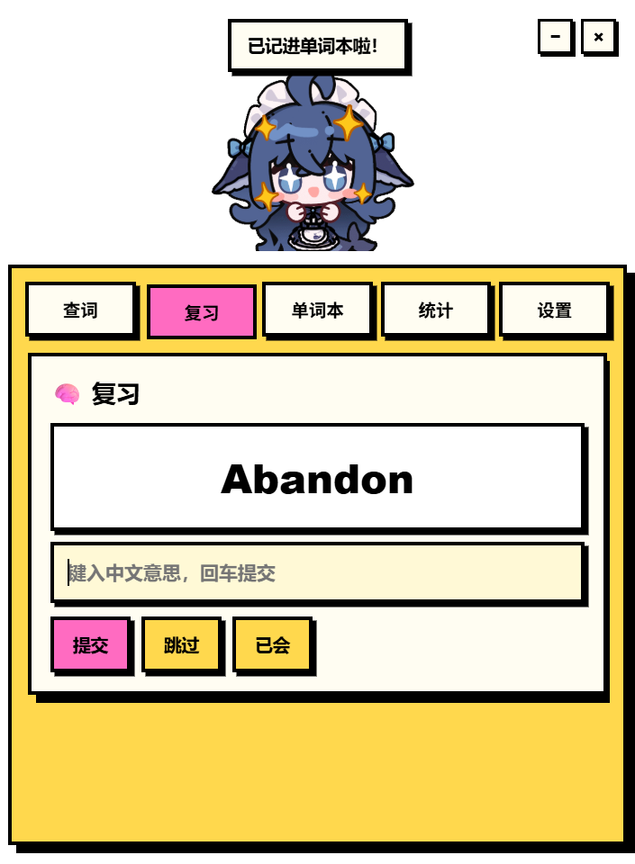
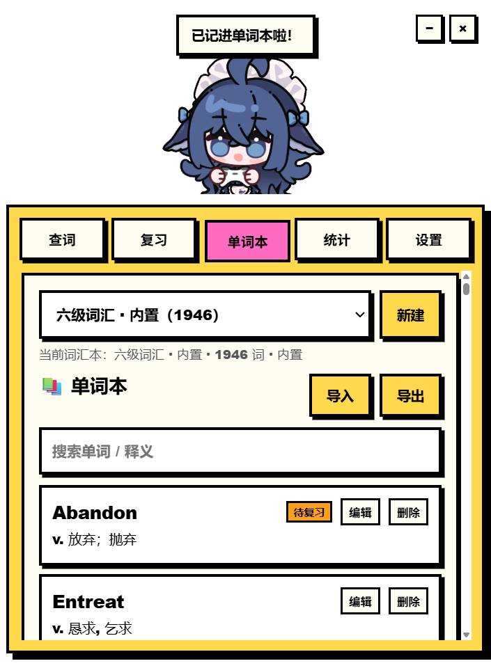

# 单词桌宠 🐱

Windows 桌面单词记忆桌宠：**阅读驱动式查词 + 剪贴板例句记录 + 自适应记忆曲线复习**。

需求详见 [需求文档.md](需求文档.md)。

## 功能

- 🖱️ **系统托盘**：托盘右键菜单支持"呼出输入栏 / 显示·隐藏桌宠 / 退出"。
- ⌨️ **快捷键全家桶**：`Alt+W` 呼出输入栏；`Alt+E` 隐藏输入栏；`Alt+P` 显示/隐藏桌宠，手不离键盘即可录入单词。
- 🔄 **开机自启动**：设置页一键开启。
- 📖 **多词汇本**：可新建自定义词汇本并切换；查词、复习、导入导出均作用于当前词汇本。
- 📗 **内置六级词汇本**：内置 1945 个 CET-6 词条（含音标、中文释义、词频），来源 [cet-words-cli](https://www.npmjs.com/package/cet-words-cli)（MIT License）。
- 🔍 **快捷键呼出查词**：全局快捷键 `Alt + W` 呼出，输入英文单词立即显示翻译（离线词库优先，在线兜底）。
- 📋 **例句自动记录**：自动读取剪贴板，找到包含该词的句子则提取并翻译保存；没有/不匹配则静默跳过。
- 🧠 **识读复习**：看英文（有原文则贴原文）→ 键入中文意思（无选项）→ 展示原文与正确释义 → 自评 0～10 掌握度。
- 📈 **自适应记忆曲线**：基于 SM-2/FSRS 风格算法，高分拉长间隔、低分拉短间隔，用户无需理解细节。
- 📚 **单词本**：搜索、编辑、删除、导入（CSV/JSON/TXT）、导出（CSV，可导入 Anki）。
- 📊 **统计与打卡**：今日新增/复习/平均自评、连续打卡、当前词汇本词数/已掌握/待复习。
- 🎨 **新野兽派 UI**：粗黑描边、硬阴影、高饱和色块；桌宠复用 `素材/` 目录 GIF。

## 界面预览

| 查词 | 识读复习 | 单词本/词汇本 |
| --- | --- | --- |
|  |  |  |

## 运行

```bash
npm install
npm start
```

> 需要 Node.js 18+。首次安装会下载 Electron；项目内置 `.npmrc` 与 `scripts/ensure-electron.js`，使用 npmmirror 镜像自动补齐二进制。
> 可用 `npm test` 运行自动化冒烟测试（查词 + 复习流程）。

## 使用提示

| 操作 | 方式 |
| --- | --- |
| 呼出输入栏 | 全局快捷键 `Alt + W`，或点击桌宠，或托盘菜单 |
| 隐藏输入栏 | `Alt + E` 或点 `−` |
| 显示/隐藏桌宠 | `Alt + P`（或托盘"显示 / 隐藏桌宠"） |
| 隐藏桌宠 | 点 `×`（再次按 `Alt + P` / `Alt + W` 可重新出现） |
| 查词 | 输入英文单词回车；查询后自动入当前词汇本 |
| 切换词汇本 | 单词本页顶部下拉框；"新建"可创建自定义词汇本 |
| 例句 | 查词前/时剪贴板里恰好有包含该词的句子，会自动记录 |
| 复习 | 进入"复习"页；答完自评 0～10；支持跳过/已会 |
| 开机自启动 | 设置页勾选"开机自启动" |
| 导入词表 | CSV/TXT 每行 `单词,释义`（可加 `,例句,例句译文`），JSON 为对象数组 |

## 项目结构

```
单词桌宠/
├── main.js               # Electron 主进程：窗口/托盘/快捷键/自启动/剪贴板/在线查词/翻译
├── preload.js            # 安全桥接（contextBridge）
├── assets/
│   └── tray-icon.png     # 托盘图标
├── scripts/
│   ├── ensure-electron.js# 自动补齐 Electron 二进制
│   ├── build-cet6.js     # 从 cet-words-cli 生成内置六级词表
│   └── make-tray-icon.js # 生成托盘图标
├── renderer/
│   ├── index.html        # 界面
│   ├── styles.css        # 新野兽派风格
│   ├── app.js            # 页面逻辑
│   ├── dictionary.js     # 内置离线六级词库（示例）
│   ├── cet6-data.js      # 内置 CET-6 词表（1945 词，由脚本生成）
│   └── scheduler.js      # SM-2/FSRS 风格自适应调度
├── 素材/                 # 桌宠 GIF（直接复用）
└── 需求文档.md
```

## 数据

- 数据保存在 Electron 用户数据目录：`%APPDATA%/word-pet/word-pet-data.json`。
- 可在"设置"里导入示例词；"单词本 → 导出"可备份（CSV 带 BOM，Excel 可直接打开）。

## 后续规划

- UIA 前台选中文本读取、OCR 截图取词
- 发音朗读、自适应 FSRS 完整实现
- 自定义桌宠形象与更多动画状态
- 安装包与自动更新
